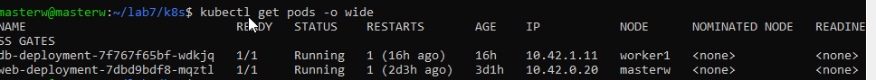
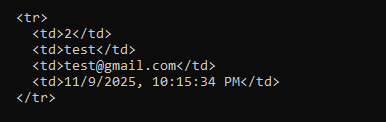

🧠 Lab 5 — Deploying a Web App and Database on K3s
📘 Project Overview

This lab demonstrates how to deploy a simple Node.js web application connected to a PostgreSQL database on a K3s Kubernetes cluster.

It introduces:

Basic Kubernetes Deployments and Services,

Communication between web and database pods,

Use of NodePort to expose the web application externally.

🏗️ Architecture
                    +--------------------------+
                    |   Web Service (NodePort) |
                    |  Port 30080 -> Web Pod   |
                    +-----------+--------------+
                                |
                                v
                    +--------------------------+
                    |  Web Deployment (app.js) |
                    |  - Express.js frontend   |
                    |  - Connects to DB via    |
                    |    db-service:5432       |
                    +-----------+--------------+
                                |
                                v
                    +--------------------------+
                    |  DB Service (ClusterIP)  |
                    |  Port 5432 -> DB Pod     |
                    +-----------+--------------+
                                |
                                v
                    +--------------------------+
                    |  DB Deployment (Postgres)|
                    |  - postgres:15-alpine    |
                    +--------------------------+

📁 Directory structure:

lab5-deploy-k3s/
├── app/                # Node.js web application
│   ├── app.js
│   ├── Dockerfile
│   ├── package.json
│   └── views/
├── k8s/                # Kubernetes YAML manifests
│   ├── db-deployment.yaml
│   ├── db-service.yaml
│   ├── web-deployment.yaml
│   └── web-service.yaml
├── scripts/            # Deployment automation scripts
│   └── deploy.sh
└── README.md

⚙️ Deployment Steps
1️⃣ Build and push the web app image
cd app/
docker build -t wajditech/lab5-web:latest .
docker push wajditech/lab5-web:latest

2️⃣ Apply Kubernetes manifests
cd ../k8s/
kubectl apply -f db-deployment.yaml
kubectl apply -f db-service.yaml
kubectl apply -f web-deployment.yaml
kubectl apply -f web-service.yaml

Check status:

kubectl get all

3️⃣ Verify application

List NodePorts:

kubectl get svc web-service

➡️ Note le port externe (ex: 30080) et visite :

http://<Node-IP>:30080

You should see the web form.

🧪 Test Instructions

Open the app in your browser (http://<node-ip>:30080).

Submit a new entry (name + email).

Check that it appears in the table below.

Alternatively, test via curl:

curl -X POST http://<Node-IP>:30080/submit -d "name=Test&email=test@example.com"
curl http://<Node-IP>:30080

## 📸 Evidence of Success

### ✅ Web App Running

### ✅ Database Pod Running

### ✅ Curl Test Showing Data Inserted

